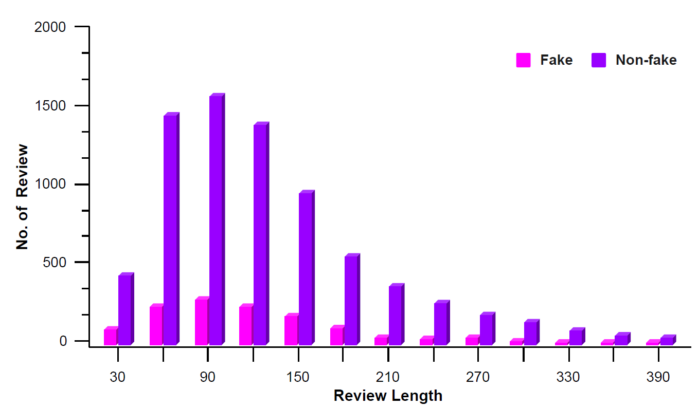

# Bengali Fake Reviews: A Benchmark Dataset and Detection System

This paper introduces the Bengali Fake Review Detection (BFRD) dataset, the first publicly 
available dataset for identifying fake reviews in Bengali. The dataset consists of 7710 non-fake 
and 1339 fake food-related reviews collected from social media posts. To convert non-Bengali 
words in a review a unique pipeline has been proposed that translates English words to their 
corresponding Bengali meaning and also back transliterates Romanized Bengali to Bengali. 
We have conducted rigorous experimentation using multiple deep learning and pre-trained transformer 
language models to develop a reliable detection system. Finally, we propose a weighted ensemble model 
that combines four pre-trained transformers: *BanglaBERT, BanglaBERT Base, BanglaBERT Large* and *BanglaBERT Generator*.

The paper **"Bengali Fake Reviews: A Benchmark Dataset and Detection System"** accepted in [Neuroomputing](https://www.sciencedirect.com/journal/neurocomputing), a journal published by Elsevier.

## Repository Structure
The repository has two folders:

Code: All the codes for deep learning models, transformers, ensemble model and text conversion pipeline are available.
Dataset: Contains two excel files (a) fake.xlsx (b) non-fake xlsx
Each file contains two columns: **Review** (collected raw reviews), **Label** (annotations).


## Dataset Statistics 
- Annotated by 4 native Bangla speakers with more than 90% trustworthiness score.

- Fleiss' Kappa Score: 0.83

## Number of Taotal Data

- Fake - 1339
- Non-fake - 7710

## Class wise statistics of BFRD dataset
|       **Statistics**       | **Fake** | **Non-fake** |
|--------------------------|---------|-------------|
|         Total words        | 1,55,789 |   9,27,902   |
|     Total unique words     |  17,739  |    51,200    |
|      Max Review length     |    693   |     1,614    |
|    Avg number of  words    |  116.35  |    120.35    |
| Avg number of unique words |   84.99  |     88.42    |

## Class wise ratio of number of reviews with respect to the review length


## Citation
If you use the datasets, please cite the following paper:
```
@article{shahariar2023bengali,
  title={Bengali Fake Reviews: A Benchmark Dataset and Detection System},
  author={Shahariar, GM and Shawon, Md Tanvir Rouf and Shah, Faisal Muhammad and Alam, Mohammad Shafiul and Mahbub, Md Shahriar},
  journal={arXiv preprint arXiv:2308.01987},
  year={2023}
}
```
